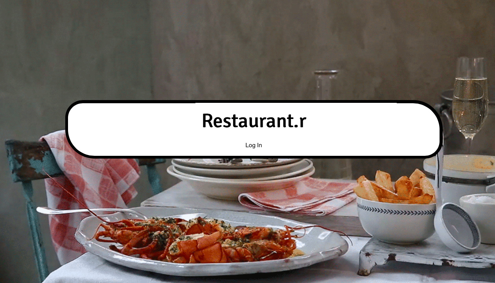

Restaurant.r - the Friendly Restaurant Order/POS All-in-One
============

Restaurant.r is a Ruby on Rails app that helps run restaurants. It's mobile-friendly, flexible, customizable, and perfect for small- to medium-sized restaurants.

Logging In
---

Logging in for the first time is simple. The username and password are both the term *admin*. Either of these screens will greet you:

Recommended use for this software is for servers to be on mobile and for managers and chefs to be on desktop/tablet. The site will function normally for any configuration, but for obvious reasons servers will want to use a small and discreet device such as a mobile touchscreen internet device, while the floor manager and the chef will be in a more stationary position. Adding/editing employees, tables, and menu items is easier to do on desktop as well.

Adding/Editing
--
Managers are able to quickly add employees, menu items, and physical tables in the restaurant. For ease of use, we suggest that such administration is done on a desktop or a tablet.

Creating employees is fairly simple and obvious--add a username, password, email, and cell phone number for any employee. This information will only be viewable to other managers with the exception of passwords. At this point, also be sure to put in the proper permissions level. It would be disastrous to have a server as a chef or even worse, a manager. It is not possible to delete a server after they have created an order, which is why it is important to take care to create a user peroperly the first time.

The employee roster view. Edits can be made here. It is best only to change the email or phone.

Adding menu items is even simpler. Prices can be added only in whole numbers. It is not necessary to indicate an allergen to create a menu item.

View menu items. Once a menu item has been part of a check, it cannot be deleted.

Add a table for each table in your restaurant using any combination of letters and integers. If there is a bar, it is advisable to create each seat as its own table.

User Story
----

It's a busy Friday night and new server Troy just got a table of 3 in his section. He enters the number of guests and the table number to create a new party.

Troy hits edit, and is able to now see the table, the check, and the order.

Troy creates the order simply by tapping on the items needed and then hits Update Party.

Troy also is able to view a preview of the check, plus tax and suggested tips. Troy can also cash out a check from here by hitting Update Party.

Troy has now created an order that will bounce to the cook, Chad.

Chad sees that Troy's latest order has come through on his mobile device. It looks like each was sent in 2 minutes ago.

Meanwhile, the manager, Sandra, can see that Troy has four open checks and one order that came in about five minutes ago. The yellow of the check items lets her know the time when they came in.

Sandra sees that the orders have now been waiting for over 10 minutes based on the orange color of the items. Also, three other tables have been waiting for even longer based on the red! She pings Chad in the kitchen to find out what's up.

Chad comes back to the kitchen to push out some pending orders. Notice the similarity in view to the mobile version. He simply needs to Update Line Item so that the order drops off his queue.

Troy's A1 table has paid out, so his check updates to green. They waited over 15 minutes for their entrees, so Sandra will have to speak to Chad about that later.

Technologies Used
--
*Front-End*: Skeleton framework, jQuery for modal effects
*Back-End*: Ruby on Rails, PostgreSQL

ERD
--
This project used five tables, four of which are pictured in the ERD. The table not depicted is an intermediary called Line_Item between Entree and Party.

